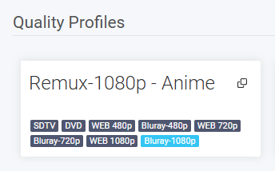
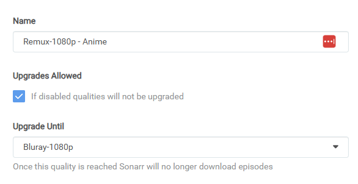
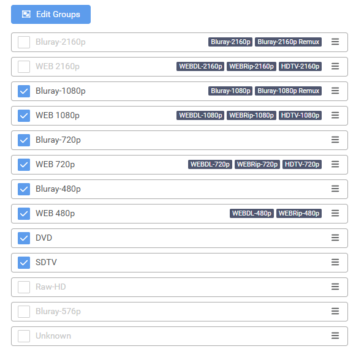
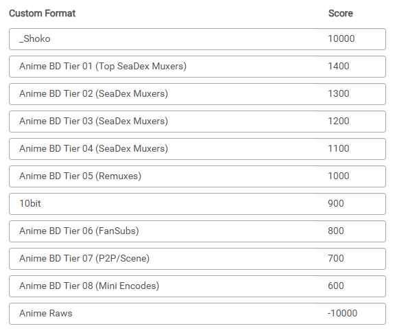
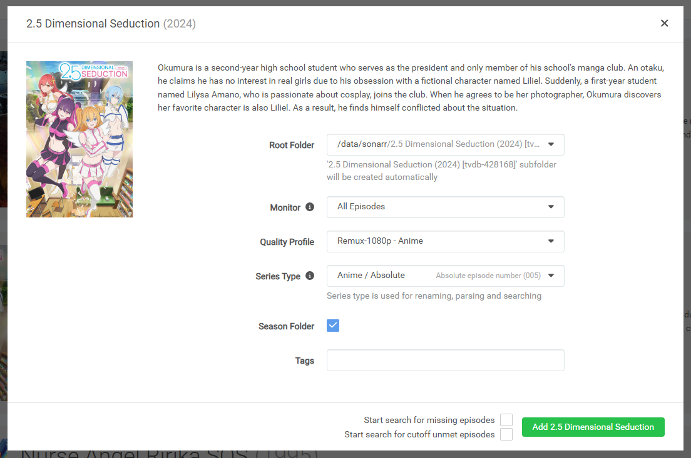
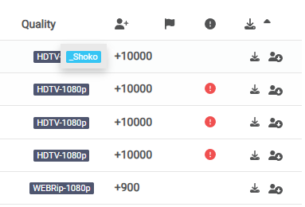

# Radarr and Sonarr work basically the same, so first here are the diferences.

- Radarr
  - qBittorent category: movies
  - [TRaSH Guides](https://trash-guides.info/Radarr/)
  - use `/data/radarr` as root folder to harlinks
- Sonarr
  - qBittorent category: series
  - [TRaSH Guides](https://trash-guides.info/Sonarr/)
  - use `/data/sonarr` as root folder to harlinks

# Because of it, I'm using Sonarr as example

## Initial configuration

Select the template, remove unused mount points, and map the share

**Notice:** Remove unused ports, or change as you need.

You can follow TRaSH in most part, like qulities, import custom formats, just these changes.

- Set root folder
- Add indexers
- Link qBittorrent
- Add `_Shoko` custom format, you can use it to put fansubs you would like to have maximum score, I use it to guarantee all files from a series I'm watch are from the same Fansub, and its suported by Shoko like this example.
  ```json
  {
    "name": "_Shoko",
    "includeCustomFormatWhenRenaming": false,
    "specifications": [
      {
        "name": "SubsPlease",
        "implementation": "ReleaseTitleSpecification",
        "negate": false,
        "required": false,
        "fields": {
          "value": "\\[SubsPlease\\]|SubsPlease"
        }
      }
    ]
  }
  ```
  > Underscore is only to make it the first in custom formats tab. <br> And add/remove formats as you like, this is the most personal config. 
- Remove all "Quality Profiles" and create like this.









## Now repeat it with Radarr and done!

- If you want you can customize Quality groups and Formats the way you like best, just dont forget to associate them.




