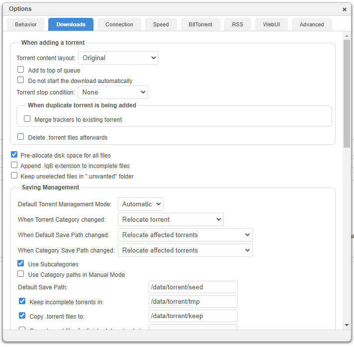
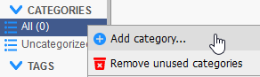
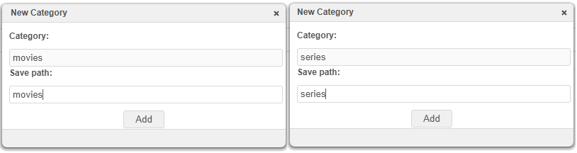

## Initial configuration

Select the template, remove unused mount points, and map the share

**Notice:** If you like me is usig this container as a new instance you need to change the ports, but for this template you have to remove "WebUI" and "Port: 6881" variables and recreate them with new values for example "WebUI: 8081" and "Port: 6882", this behavior is due to how qBittorrent implement authentication and is explainda better in [Application Setup](https://hub.docker.com/r/linuxserver/qbittorrent)

Once the container is running, open container logs and grab the initial user/pass, log in the UI, and change to you new user/pass

Your will have to apply the following configurations in the `Options`.

- ☑️ **Pre-allocate disk space for all files**
- `Saving management` section
  - Default Torrent Management Mode: `Automatic`
  - When Torrent Category changed: `Relocate torrent`
  - When Default Save Path changed: `Relocate affected torrents`
  - When Category Save Path changed: `Relocate affected torrents`
  - Default Save Path: `/data/torrent/seed`
  - ☑️ Keep incomplete torrents in: `/data/torrent/tmp`
  - ☑️ Copy .torrent files to:: `/data/torrent/keep`

## External hardlink script configuration

Put the file [scripts/qbittorrent_hardlinks.py](https://github.com/pokyunn/selfhosted-anime/blob/main/files/scripts/qbittorrent_hardlinks.py) in `appdata/qbittorrent-anime/qBittorrent/qbittorrent_hardlinks.py`

Then  back in qBittorrent options scroll a bit down, and you will find the `Run external program` section, here we'll make use of a custom script created by a good friend of mine, so shoutout to Bestfast.

- ☑️ Run external program on torrent finished: `python /config/qBittorrent/qbittorrent_hardlinks.py "%F" "%L"`

The script basically grabs two variables `"%F" "%L"` in input, which for qBittorrent they are `%L: Category` and `%F: Content path (same as root path for multifile torrent)` and creates an hardlink.

## Category configuration

You'll then need to create the two categories listed in the script:

## IMPORTANT! When downloading manually, be sure to set the category!

- If you import it manualy in qBittorrent, as for private trackers, radarr/sonarr wont see it and if you want, just create a hardlink to them.